# Substrate 区块链开发入门

## 老师

孙凯超 kaichao@parity.io

Maggie Dong maggiedong@parity.io

## 资源

Substrate的官方文档

Https://substrate.dev

Rust官方网站

https://www.rust-lang.org/

Rust官方数据

https://doc.rust-lang.org/book/

如何学习Substrate

https://zhuanlan.zhihu.com/p/161771205

## 课程介绍

由Parity和一块链习社区合作，学员将学习区块链和substrate的基础知识，以及如何编写一个简单的区块链应用

- 拥有一定的开发经验、或对编程感兴趣
- 在校学生、开发者、创业者

# 什么是区块链

## 传统的记账方式

所有的账本都存在银行的中心化服务器

## 区块链的记账方式

每个人都可以保存一份账本

## 随之而来的问题

- 谁可以往账本上写东西？
  - 如何证明你是你？
  - 如何防止恶意攻击？
- 如何确保所有人维护的账本都一样？
  - 为什么要维护同一份账本？
  - 如果有人的账本和其他人的不一样，会怎么办？

## 谁可以向账本里写入内容

任何人

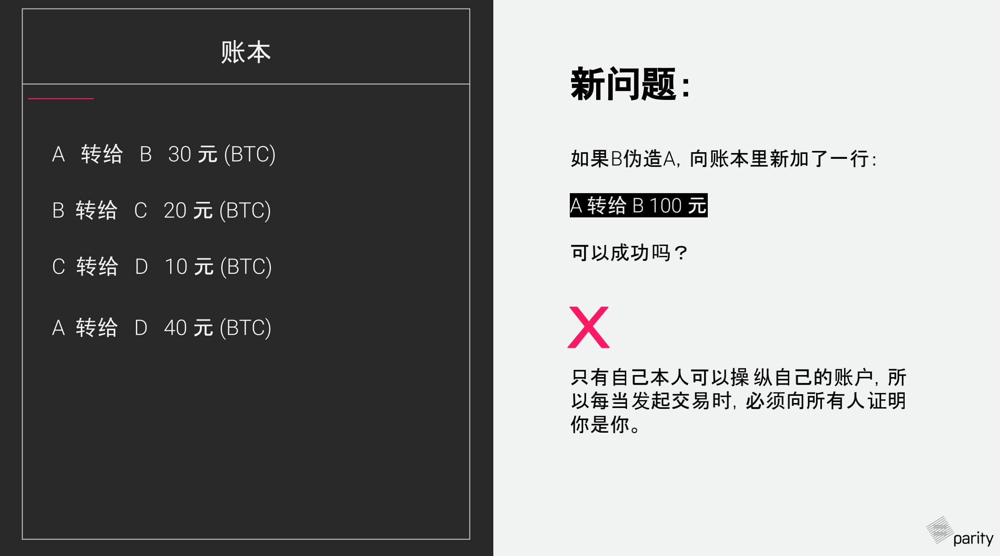

也就是说，只有你自己才能发起交易，别人不能伪造你去触发交易。只有自己本人可以操作自己的账户，所以每当发起交易时，必须向所有人证明你是你。

## 如何证明你是你呢？

数字签名算法

## 传统的手写签名

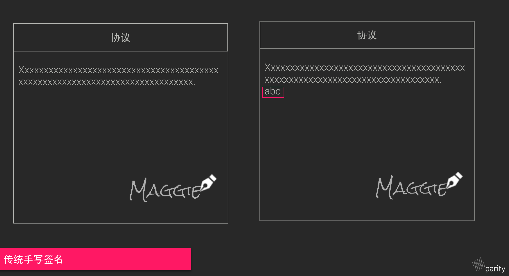

## 对于数字签名来说

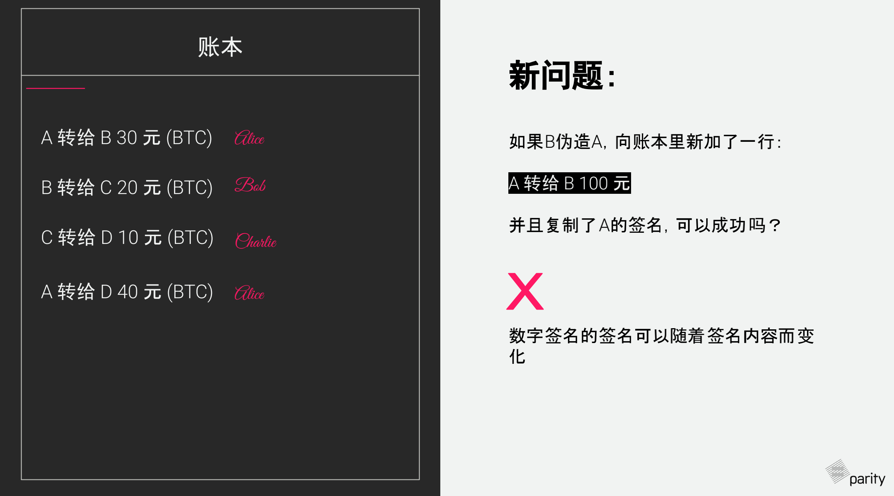

这里B伪造A，向账本中新添加了一行，这是错误的，并且复制了A的签名。这是不会成功的。因为数字签名的签名可以随着签名的内容而变化。

## 数字签名算法

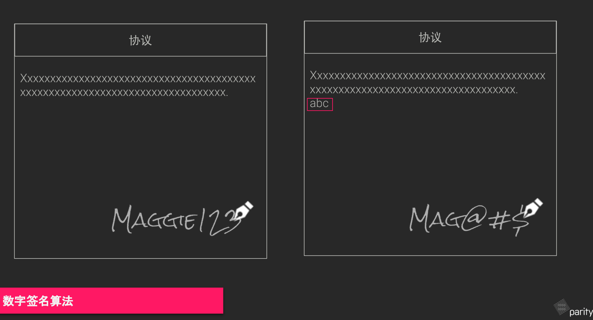

签名就是用私钥对需要签名的内容签名，然后得到签名后的东西 Signature.

所以说签名就是使用一个私钥和签名的消息进行签名得到签名后的内容，也就是签名。

验证的化，就是用公钥，（公钥对于所有人来说都是公开的，可以知道的，加上签名还有你签名的消息做一个验证）返回结果是成功还是失败，这个验证是很快的

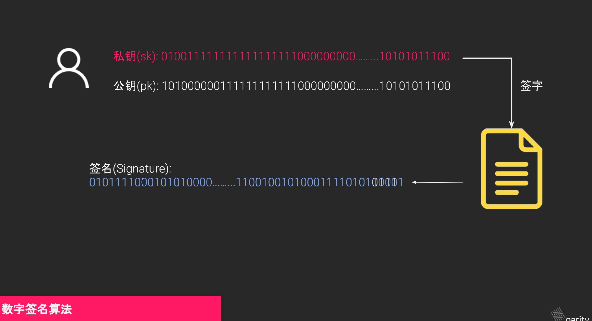

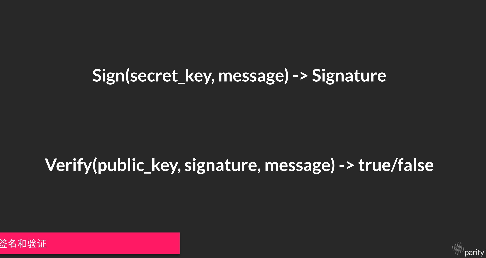

但是会遇到一个新的问题，要是别人去复制你的交易这样交易可以被多次复制使用。为了避免这个问题。在区块中增加了一个nonce值的设定，就算签名是一样的。交易的内容也是一样的但是还有一个nonce值的记录，这样就会保证一定不会发生交易复制攻击。nonce值要保证是依次递增的。

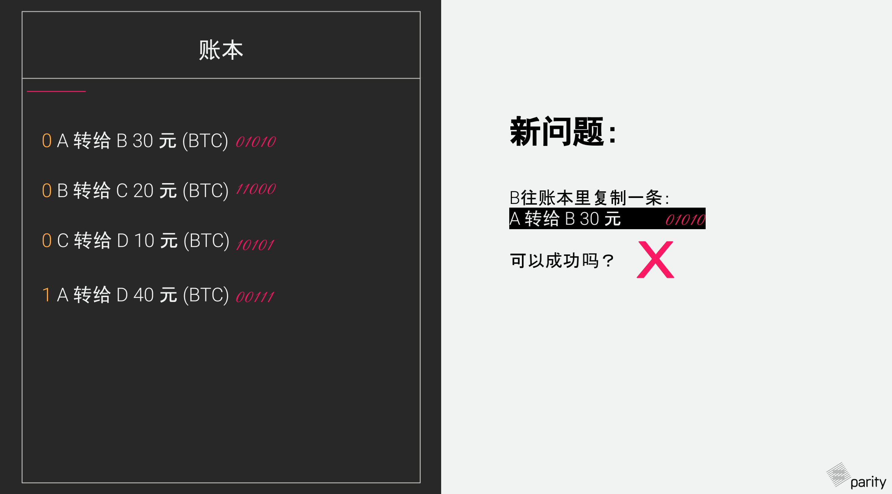

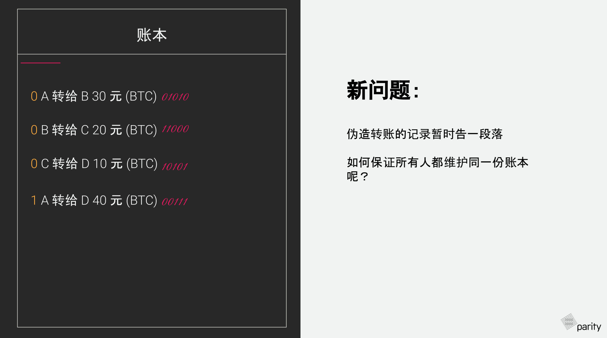

## 小结

- 账本 = 交易历史
- 每个人都可以向账本里添加内容
- 用私钥签名，公钥向其他人证明，因此私钥绝对不可以泄露，但是公钥可以展示给别人、
- 每个人的交易里包含了一个自增长数字nonce,用于防止别人复制攻击

## 每个人都可以保存账本

## 如何确保每个人的账本都一样呢？

## 如何维护账本的一致性

通过共识机制

## 什么是Hash 

Trapdoor function

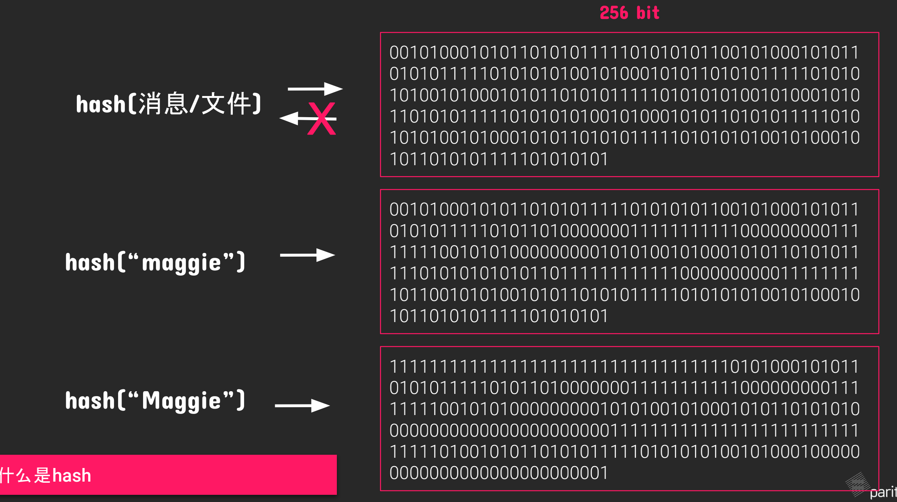

Hash 就是对消息去做hash计算，得出来的值是一个256bit的二进制的编码数字。只要求hash的消息有任何的变化，得出的hash值就是不一样的

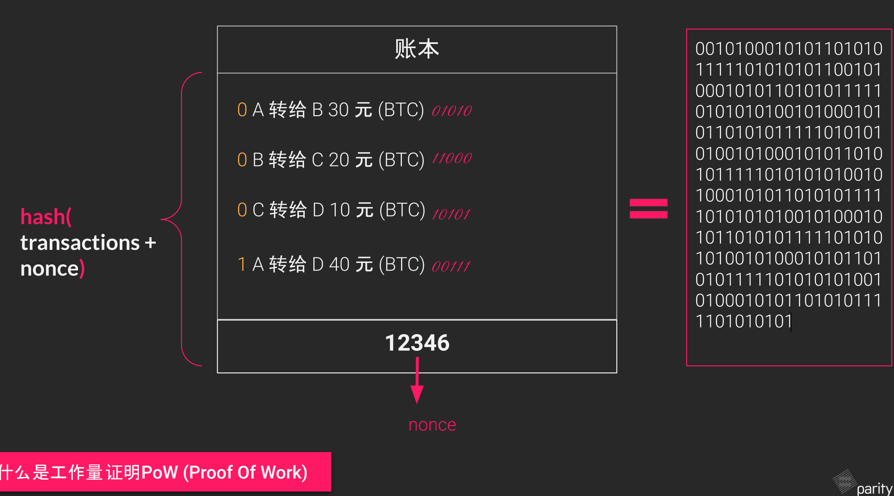

工作量证明就是求解这里面的nonce值，使得求得hash值后的前多少位是固定长度的0值

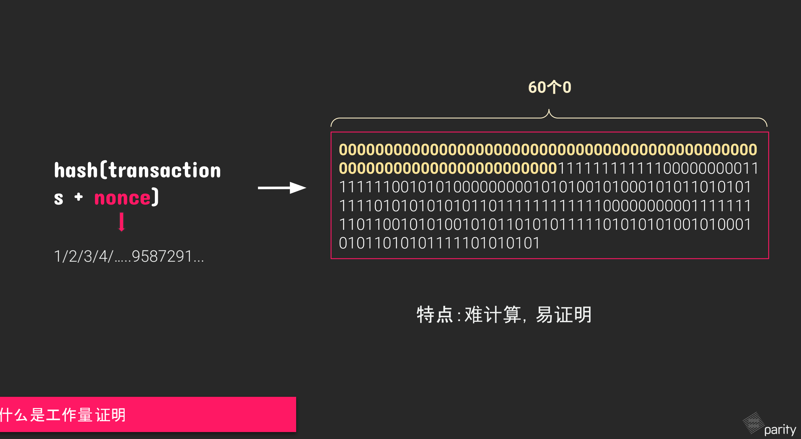

工作量证明的特点就是难易证明

## 什么是区块

区块就是打包的各种不同的交易区块

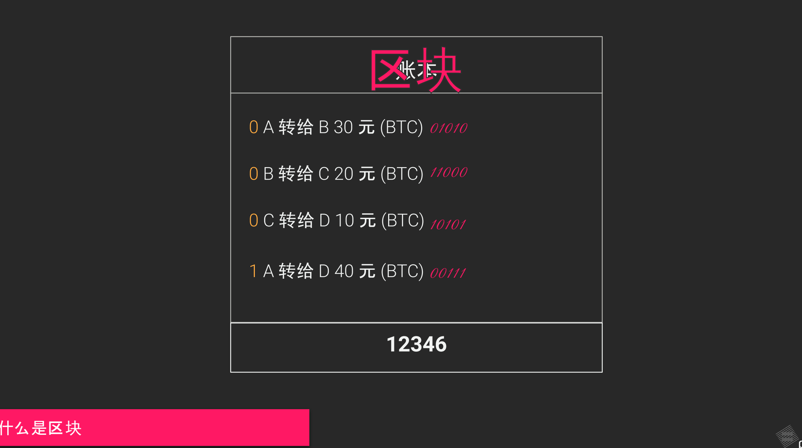

## 什么是区块链呢

每个区块中包含了一个hash值。每个区块的hash的计算是通过hash整个区块的内容求得的，而区块的内容中包含了上一个区块的hash值。每个区块通过hash值串联起来，构成了一条区块链

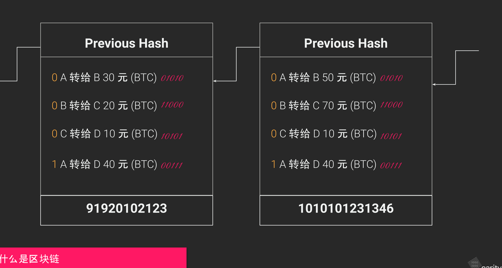

## 真实的区块是什么样子的

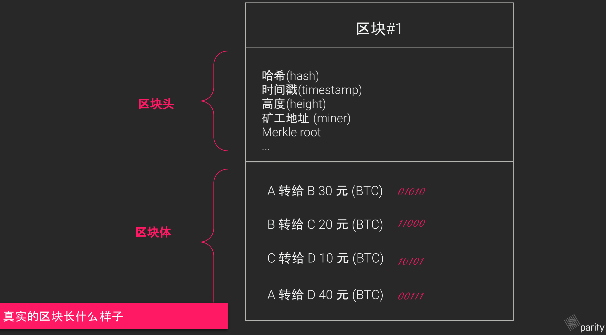

## 为什么大家要维护一样的账本 

因为有奖励

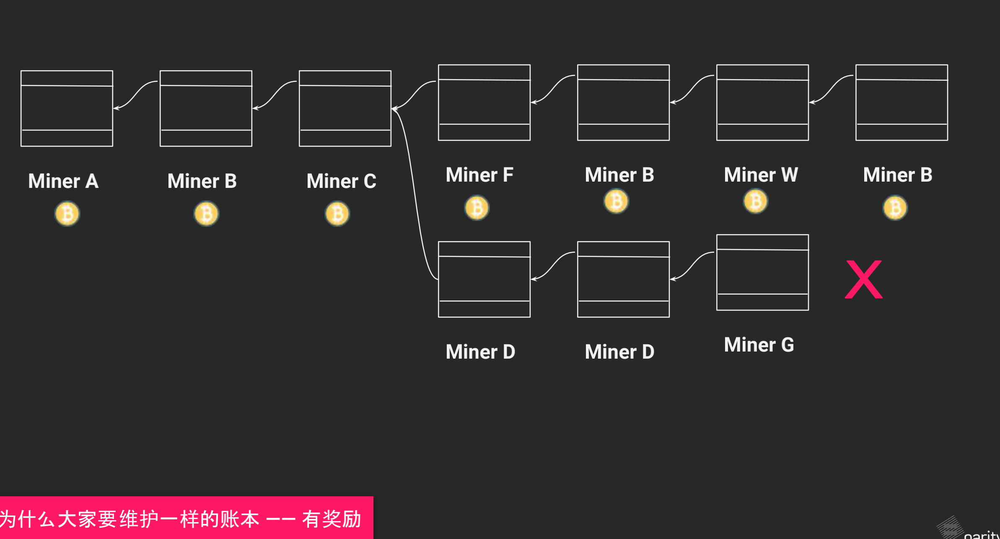

## 小结

- 哈希函数：将任何文件 、 文本 变成一串256bit的01串，难碰撞，不可逆
- 工作量证明 => 不停地算出符合要求的哈希值
- 产生分叉怎么办 => 等待最长链的出现

