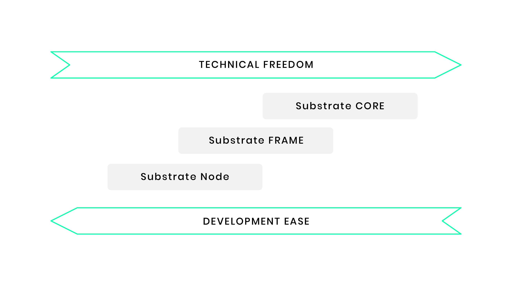

# 概述

欢迎来到使用Substrate进行区块链开发的奇妙世界！这是Substrate知识库，是Substrate开发者的官方文档中心。本资源的目的是帮助读者了解用Substrate进行区块链开发的错综复杂的问题。本指南分为几个部分，解释了Substrate所基于的原则和设计决策，以及成为一个有效的Substrate区块链开发者所需的具体技能。

> 需要一些专业知识

> 为了最大限度地利用Substrate，你应该对计算机科学和基本的区块链概念有良好的了解：头、区块、客户端、哈希、交易和签名等术语应该是熟悉的。Substrate是建立在Rust编程语言上的，它利用新颖的设计模式，使代码的开发安全而快速。尽管你不需要知道Rust就可以开始使用Substrate，但对Rust的良好理解将使你成为一个更好的Substrate开发者。请查看Rust社区提供的优秀[资源](rust-lang.org/learn)，以培养你的Rust开发技能。

Substrate采用模块化方法进行区块链开发，并定义了一套丰富的基元，使开发人员能够利用强大的、熟悉的编程习惯。

## 使用方法

Substrate被设计为以三种方式之一来使用。

1. 使用Substrate节点: 你可以运行预先设计好的[Substrate节点](https://github.com/paritytech/substrate/tree/master/bin/node)并[配置](https://github.com/paritytech/substrate/blob/master/bin/node/cli/src/chain_spec.rs)其创世区块。在这种情况下，你只需要提供一个JSON文件并启动你自己的区块链。该JSON文件允许你配置组成Substrate Node运行时间的模块的创世状态，例如: Balances, Staking, and Sudo. 你可以在[创建你的第一个substrate链](https://substrate.dev/docs/en/tutorials/create-your-first-substrate-chain/)和[启动一个私人网络](https://substrate.dev/docs/en/tutorials/start-a-private-network/)的教程中了解更多关于运行一个substrate节点的信息。

2. 通过Substrate FRAME: 你可以使用[FRAME](https://substrate.dev/docs/en/knowledgebase/runtime/frame)（模块化实体的运行时聚合框架）轻松地创建你自己的自定义运行时，这就是用来构建Substrate节点的。这为你的区块链逻辑提供了大量的自由，并允许你配置数据类型，从模块库（称为 "Pallet"）中选择，甚至添加你自己的自定义托盘。对于这样的项目，[Substrate开发者中心节点模板](https://github.com/substrate-developer-hub/substrate-node-template)是一个有用的起点。要了解更多信息，请参见[构建一个dApp](https://substrate.dev/docs/en/tutorials/build-a-dapp/)和[添加一个托盘](https://substrate.dev/docs/en/tutorials/add-a-pallet/)的教程。

3. 使用Substrate核心: 整个FRAME系统可以被忽略，而运行时可以从头开始设计和实现。这可以用任何可以针对[WebAssembly](https://webassembly.org/)的语言来完成。如果运行时可以与Substrate节点的抽象块创作逻辑兼容，那么你可以简单地从你的Wasm blob中构建一个新的创世块，并使用现有的基于Rust的Substrate客户端启动你的链。如果不是，那么你将需要改变客户端的块创作逻辑，甚至有可能改变头和块的序列化格式。就开发工作而言，这是迄今为止使用Substrate的最困难的方式，但也给了你最多的自由来进行创新。

Substrate允许开发者在其设计决策的每一步中，在技术自由和开发便利之间做出选择。下面的图表说明了这种灵活性的本质。

## 接下来的步骤

### 了解更多

- 参考[FRAME系统的开发者文档]()，进行运行时开发。
- 了解如何通过使用Polkadot-JS系列库为任何基于Substrate的链创建丰富的客户端应用程序。
- 深入研究高级主题，如Substrate的[SCALE编码](https://substrate.dev/docs/en/knowledgebase/advanced/codec)、[共识机制](https://substrate.dev/docs/en/knowledgebase/advanced/consensus)、[密码学](https://substrate.dev/docs/en/knowledgebase/advanced/cryptography)和[存储实现](https://substrate.dev/docs/en/knowledgebase/advanced/storage)。

### 实例

- 按照我们的[教程](https://substrate.dev/tutorials)，学习使用Substrate和FRAME构建和运行区块链。
- 参考[Substrate Recipes](https://substrate.dev/recipes/)，找到完整的工作实例，展示常见问题的解决方案。

### 参考文献
- 请查看随Substrate代码库一起提供的[Rust参考文档](https://substrate.dev/rustdocs/v3.0.0-monthly-2021-05/sc_service/index.html)。